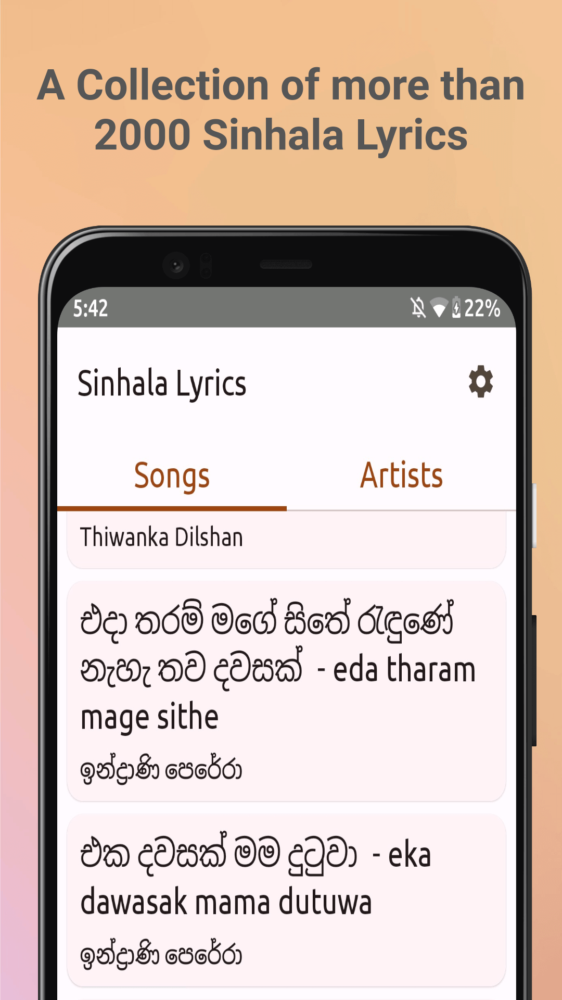
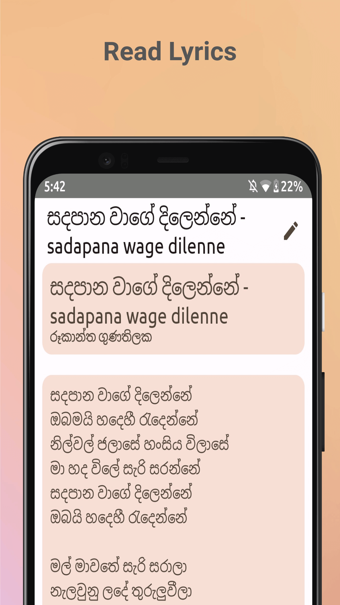
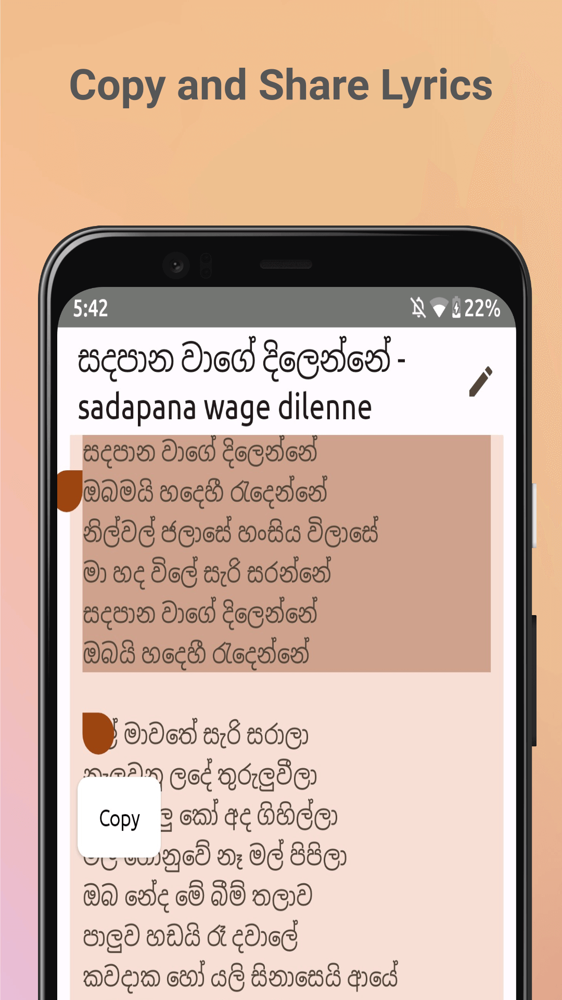
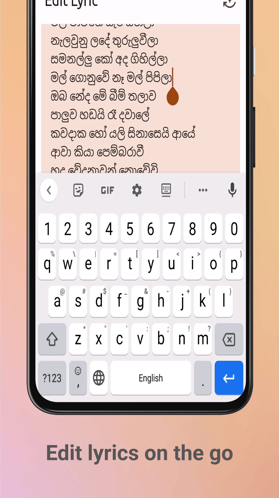
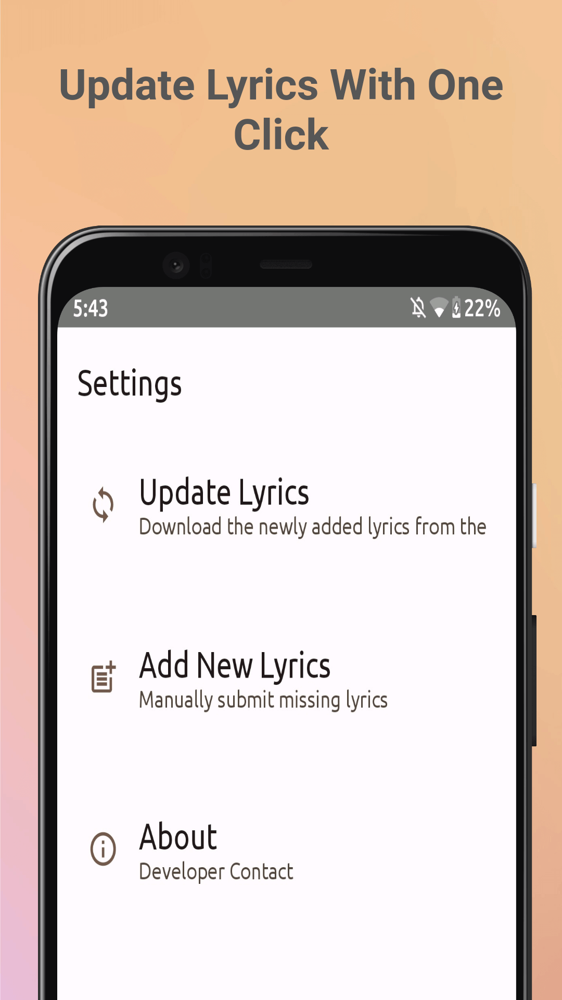

  
  <h1 align="center">Sinhala Lyrics App</h1>
  
<b>Sinhala Lyrics</b> is a Sinhala song lyrics viewer Android app.

---

  
  
  
  
  

## Features
- A Collection of more than 2000 Sinhala Lyrics
- Regular Lyric Updates
- You can submit new lyrics with ease
- Read, Copy, Share lyrics
- Edit lyrics on the go

## Installation

